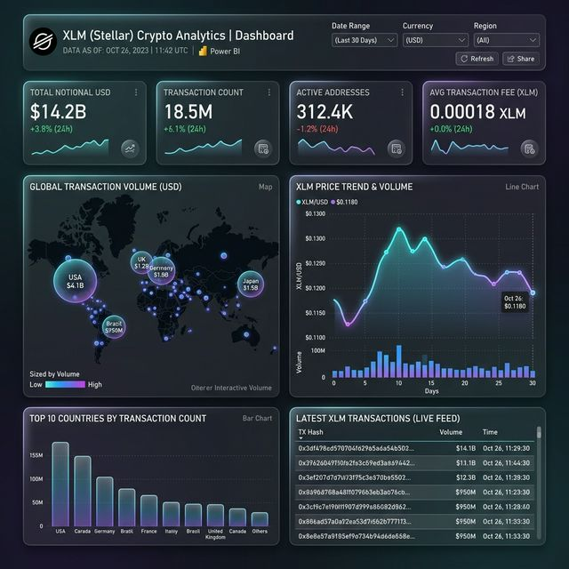

# 05 - Dashboard Power BI

Para implantar o dashboard, utilizaremos a camada de **Serving** no Postgres, que já contém as tabelas agregadas (Gold).

## 1. Pré-requisitos
- [Power BI Desktop](https://powerbi.microsoft.com/desktop/) instalado.
- Certifique-se de que os containers Docker estão rodando (`docker compose up -d`).

## 2. Conectar o Power BI ao Postgres
Abra o Power BI Desktop e siga estes passos:

1.  **Obter Dados**: Clique em `Obter Dados` -> `Mais...` -> `Banco de Dados` -> `Banco de dados PostgreSQL`.
2.  **Servidor**: Use `localhost:5432`.
3.  **Banco de Dados**: Digite `xlm`.
4.  **Credenciais**: 
    - Porta: `5432`
    - Usuário: `xlm`
    - Senha: `xlm`
5.  **Importar**: Selecione as tabelas que começam com `gold_`:
    - `gold_xlm_hourly`
    - `gold_xlm_daily`
    - `gold_xlm_by_country_daily`
6.  Clique em **Carregar**.

## 3. Visuais Recomendados
Com as nossas tabelas Gold, você pode criar:
- **Tendência de Preço**: Gráfico de linhas com `day_ts` no Eixo e `avg_price_usd` nos Valores.
- **Análise Geográfica**: Mapa com `country_code` como Localização e `tx_count` ou `total_notional_usd` como Tamanho da Bolha.
- **Cards de KPI**: Cards simples para `Soma de total_notional_usd` e `Soma de tx_count`.
- **Top Mercados**: Gráfico de barras mostrando `total_volume_xlm` por `country_code`.

## 4. Lógica da Camada de Serving
O script `transform_gold.py` foi atualizado para automaticamente "servir" (carregar) os resultados para o Postgres após processá-los no Spark. Isso garante que o Power BI sempre tenha acesso aos dados agregados mais recentes sem precisar ler arquivos Parquet complexos diretamente.

