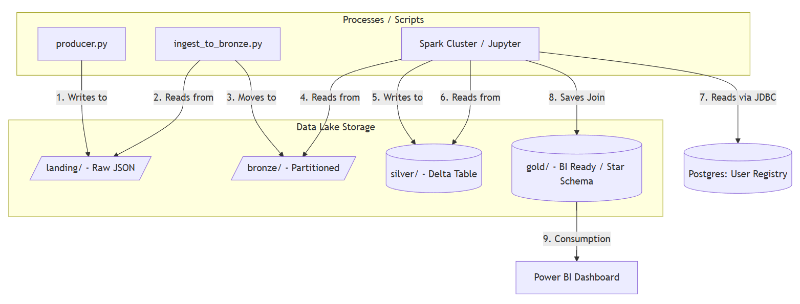
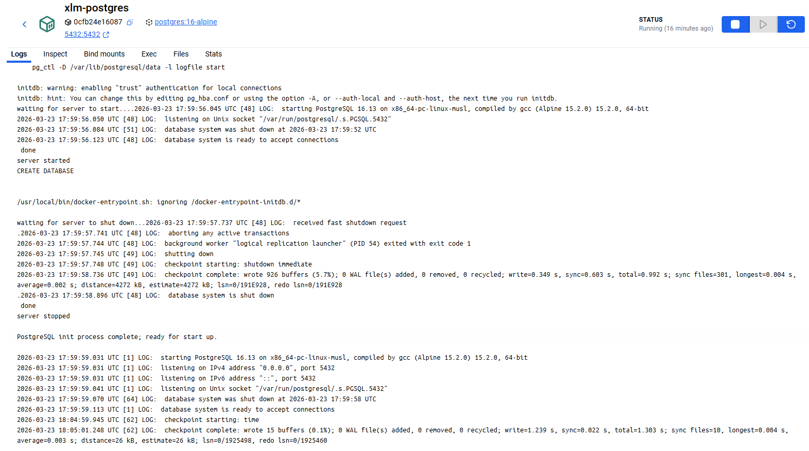
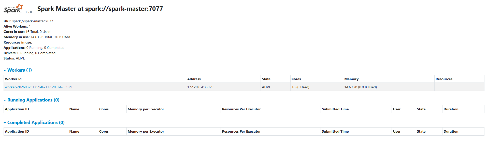
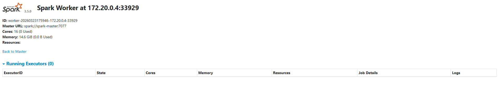
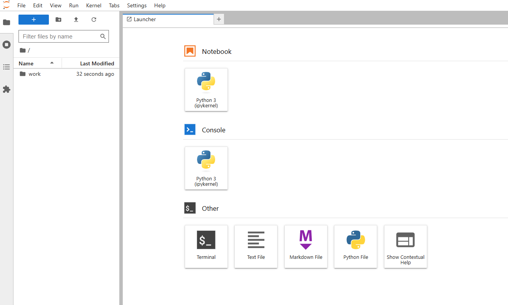

# Docker Stack Overview (Why each piece exists)

This document explains the Docker Compose stack used in this repository, the purpose of each service, and how they connect. It also includes placeholders so you can paste screenshots from Docker Desktop and UIs.

## High-level architecture

The stack is designed to simulate a typical data engineering local environment:

- A relational database (Postgres) as a “source system”
- A processing engine (Apache Spark) to transform data through bronze/silver/gold
- A notebook environment (JupyterLab) to develop and run PySpark code
- A shared local folder (`data_lake/`) that acts like an “Azure Data Lake” on your machine

### Screenshot placeholder (architecture diagram)




## Services

### 1) `postgres` (source system / reference data)

**Image**
- `postgres:16-alpine`

**Why it exists**
- Simulates structured source data (e.g., users/customers/countries)
- Enables SQL joins during the “gold” analytics step (Spark can read from Postgres)

**How data persists**
- Uses a host-mounted volume:
  - `./postgres-data` → `/var/lib/postgresql/data`

**How to connect**
- Host port: `5432`
- Connection settings:
  - host: `localhost`
  - port: `5432`
  - database: `xlm`
  - user: `xlm`
  - password: `xlm`

### Screenshot placeholder (Docker Desktop container view)



### 2) `spark-master` (Spark cluster coordinator)

**Image**
- `apache/spark:3.5.0`

**Why it exists**
- Runs the Spark master process that:
  - Accepts worker registrations
  - Schedules jobs across the cluster
  - Exposes the Spark Master UI

**Ports**
- `7077`: Spark master RPC (workers + clients connect here)
- `8080`: Spark Master Web UI (host: http://localhost:8080)

**Data lake access**
- Host folder mounted into the container:
  - `./data_lake` → `/data_lake`

### Screenshot placeholder (Spark Master UI)



### 3) `spark-worker-1` (Spark executor capacity)

**Image**
- `apache/spark:3.5.0`

**Why it exists**
- Runs the Spark worker process that:
  - Registers with the master (`spark://spark-master:7077`)
  - Provides CPU/RAM resources to execute tasks
  - Exposes the Spark Worker UI

**Ports**
- `8081`: Spark Worker Web UI (host: http://localhost:8081)

**Data lake access**
- Host folder mounted into the container:
  - `./data_lake` → `/data_lake`

### Screenshot placeholder (Spark Worker UI)



### 4) `jupyter` (development + notebooks)

**Image**
- `jupyter/pyspark-notebook:latest`

**Why it exists**
- Provides JupyterLab ready for PySpark development
- Acts as the “developer workstation” inside Docker
- Connects to the Spark master to submit jobs to the cluster

**Ports**
- `8888`: JupyterLab (host: http://localhost:8888)

**Volumes**
- `./data_lake` → `/home/jovyan/work/data_lake`
  - Lets notebooks read/write the same “lake” folders used by the pipeline
- `./03_processing_silver` → `/home/jovyan/work/03_processing_silver`
  - Keeps notebooks versioned in the repo while editable in Jupyter

**Spark connectivity**
- Inside the Docker network, the master is reachable as:
  - `spark://spark-master:7077`
- The compose sets `SPARK_MASTER=spark://spark-master:7077` for convenience.

### Screenshot placeholder (JupyterLab)



### 5) `streamlit` (dashboard)

**Image**
- `python:3.11-slim`

**Why it exists**
- Provides a lightweight Python dashboard to visualize Gold tables
- Reads Parquet exports from `data_lake/gold/parquet/` written by the Gold job

**Ports**
- `8501`: Streamlit UI (host: http://localhost:8501)

**Volumes**
- `./05_dashboard_python` → `/app`
  - Dashboard code (`app.py`)
- `./data_lake` → `/data_lake`
  - Reads Gold Parquet directly from the shared lake folder

## Networks

### `xlm-net` (bridge network)

**Why it exists**
- Gives all services a shared DNS space (service names become hostnames):
  - `postgres`
  - `spark-master`
  - `spark-worker-1`
  - `jupyter`
  - `streamlit`
- Makes Spark master/worker communication stable and predictable.

## Data flow (how the stack supports the project folders)

This stack supports a typical lakehouse-style project layout:

- `data_lake/landing/`: raw JSON drops from the simulator
- `data_lake/bronze/`: partitioned raw data
- `data_lake/silver/`: cleaned/typed data (Delta/Parquet)
- `data_lake/gold/`: analytics-ready tables for BI


## Common operational checks

Verify everything is up:

```bash
docker compose ps
```

Follow logs:

```bash
docker compose logs -f
```

Spark UIs:
- Master: http://localhost:8080
- Worker: http://localhost:8081

Jupyter:
- http://localhost:8888

Streamlit:
- http://localhost:8501
